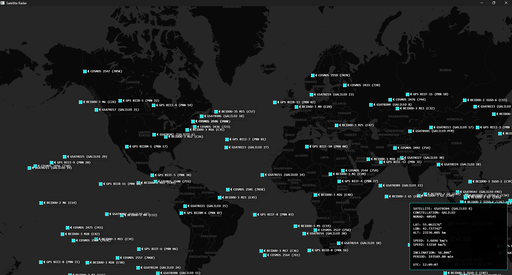

# GpsSatTracker

A real-time satellite tracking desktop application built with Python.  
It visualizes satellites moving live on a world map using orbital mechanics and a web-based map engine embedded inside a Qt desktop GUI.

---

## Features

- Real-time satellite tracking (GPS, GLONASS, Galileo, BeiDou)
- Interactive world map visualization
- Live motion trails for satellites
- Detailed satellite telemetry (speed, altitude, orbit data)
- Click-to-inspect satellite information panel
- Updates every second (real-time simulation)
- Python ↔ JavaScript live communication bridge

---

## Main Technologies Used

###Orbital Mechanics Engine
**Skyfield**

Used for:
- Parsing TLE (Two-Line Element) orbital data
- Computing real-time satellite positions
- Calculating:
  - Velocity
  - Altitude
  - Inclination
  - Orbital period

Key objects:
- `EarthSatellite` → satellite representation
- `ts.now()` → real-time simulation clock

---

### Map Visualization
**Leaflet.js**

Used for:
- Rendering interactive world map
- Displaying satellite markers
- Drawing orbital trails (polylines)
- Handling click events on satellites

Map style:
- Dark theme (CartoDB dark tiles)

---

### Desktop GUI Framework
**PyQt6**

Used for:
- Desktop window interface (`QMainWindow`)
- Embedded web browser (`QWebEngineView`)
- Periodic updates (`QTimer`)
- Window rendering and lifecycle management

---

###Python ↔ JavaScript Bridge
**Qt WebChannel**

Used for real-time communication between backend and frontend:

- JS → Python:
  - Satellite click events (`sat_clicked`)
- Python → JS:
  - Satellite updates
  - Info panel updates (`show_info`)

---

### Satellite Data Source
**CelesTrak**

Provides live TLE datasets for:

- GPS satellites
- GLONASS satellites
- Galileo satellites
- BeiDou satellites

---

## How It Works

1. TLE data is downloaded from CelesTrak
2. Skyfield parses orbital parameters
3. Satellite positions are calculated every second
4. PyQt sends updated coordinates to JavaScript
5. Leaflet renders satellites on a live map
6. Trails and telemetry are updated in real time

---

## Satellite Telemetry Display

When a satellite is clicked, the system shows:

- Latitude / Longitude  
- Altitude (km)  
- Speed (km/s & km/h)  
- Orbital inclination  
- Orbital period  
- Satellite name + NORAD ID  
- Current UTC time  

---

## Core Application Structure

### Radar Main Class

Responsible for:
- Initializing Qt application window
- Loading satellites from TLE sources
- Starting update timer (1 second interval)
- Managing WebEngine map view
- Sending live satellite updates to frontend

### Bridge Class

Handles:
- Communication between JS and Python
- Satellite click events
- Sending telemetry data to UI panel

---

## Dependencies

- Python 3.10+
- PyQt6
- PyQt6-WebEngine
- Skyfield
- Requests

---

## Performance Notes

- Trail length is limited to reduce rendering load
- Updates run at 1Hz for balance between accuracy and performance
- Designed for medium-scale constellation visualization

---

## Project Goal

To provide a **visual, real-time representation of satellite motion around Earth** using accurate orbital mechanics and a responsive interactive map interface.

---
